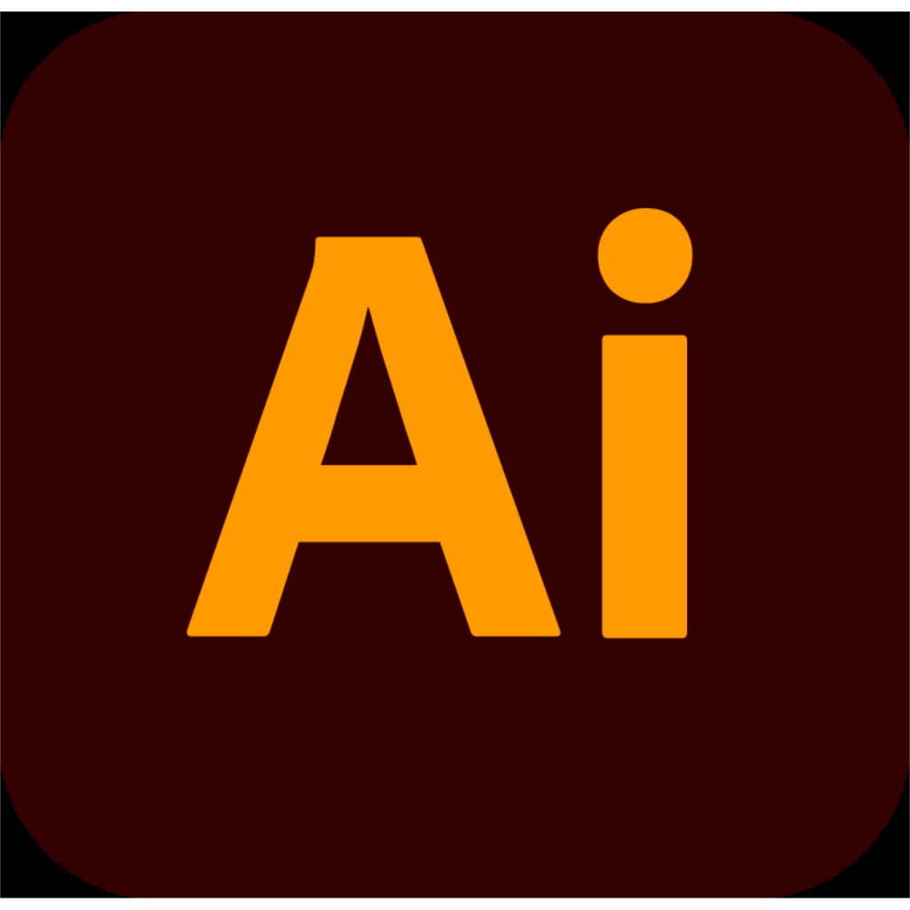

<h1 align="center">
  Hi, I'm Jhony Aguilar!
  
</h1>

  

---
## <picture></picture> About me

<picture> </picture>

 

- 💻 I’m a passionate developer  
- 🌐 Visit my [GitHub](https://github.com/Jhony410)  
- 🛠️ Languages: `.cpp`, `.html`, `.py`, `.sql`, `.c#` 
- 🧠 Learning: Docker, TypeScript  
- 🌟 Open to collaboration and learning  

 
### 🛠 &nbsp;Tech Stack

&nbsp;
&nbsp;
&nbsp;
&nbsp;
&nbsp;
\
&nbsp;
&nbsp;
&nbsp;
&nbsp;
\
&nbsp;
&nbsp;
&nbsp;
&nbsp;
\
&nbsp;
&nbsp;
\
&nbsp;
&nbsp;

### 📊 GitHub Stats

  
  
  

<h2 align="center">Top Languages 👇</h4>

  

---
### 🤝 Connect with me

  
  
  
  
  

---
### 🔥 Tech I Love

  <!-- JavaScript -->
  
  <!-- Python -->
  
  <!-- React -->
  
  <!-- GitHub -->
  
  <!-- VS Code -->
  
  <!-- MySQL -->
  
  <!-- Android Studio -->
  
  <!-- C (respaldo) -->
  
  <!-- C++ -->
  
  <!-- C# -->
  
  <!-- PHP -->
  
  <!-- Kotlin -->
  
  <!-- Visual Studio -->
  
  <!-- PostgreSQL -->
  
  <!-- SQL server -->
  
  <!-- GO (respaldo) -->
  
  <!-- Docker (respaldo) -->
  
  <!-- HTML -->
  
  <!-- CSS -->
  

---
### 🎨 Creative Tools

  <!-- Photoshop -->
  
  <!-- Illustrator -->
  
  <!-- Premiere Pro -->
  
  <!-- After Effects -->
  
  <!-- Lightroom -->
  
  <!-- CapCut -->
  
  <!-- DaVinci Resolve -->
  
  <!-- Camera RAW -->
  
  <!-- Canva -->
  

---

	

---

<h2 align="center">
   I ❤ Open Source.
</h2>

