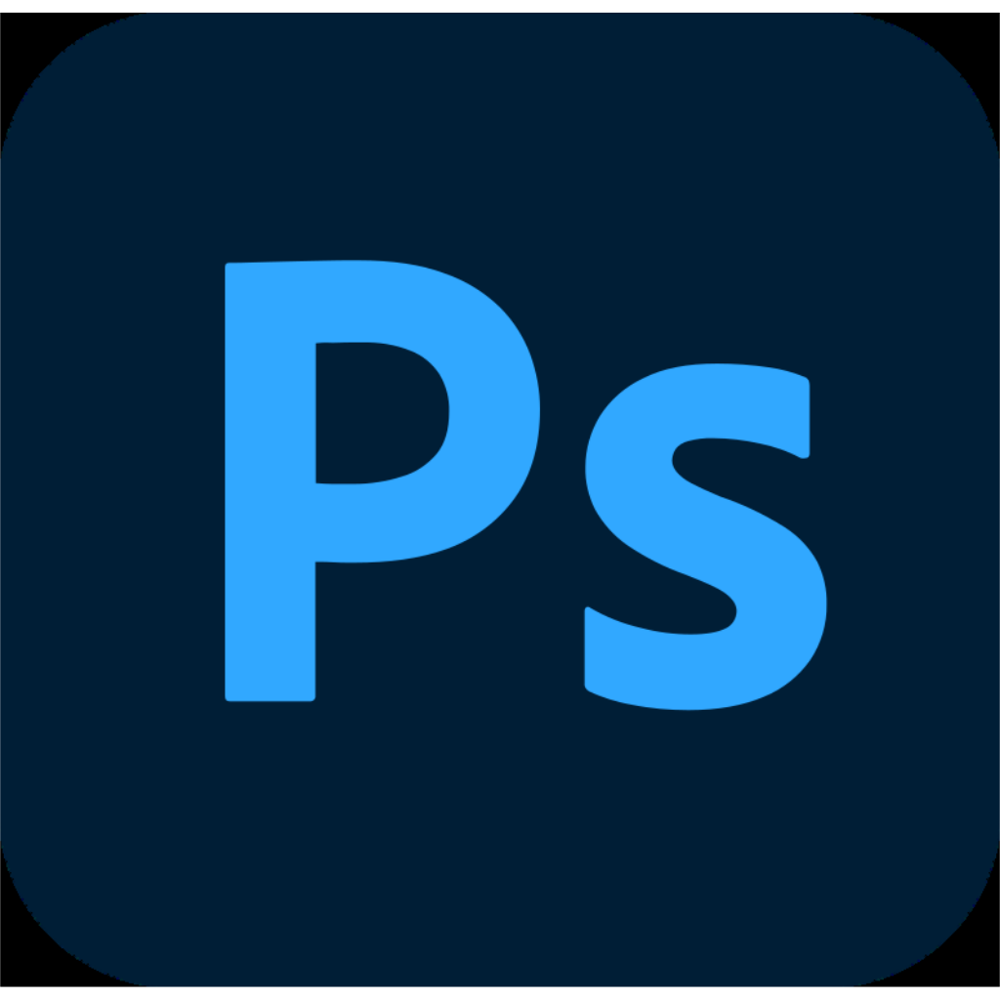
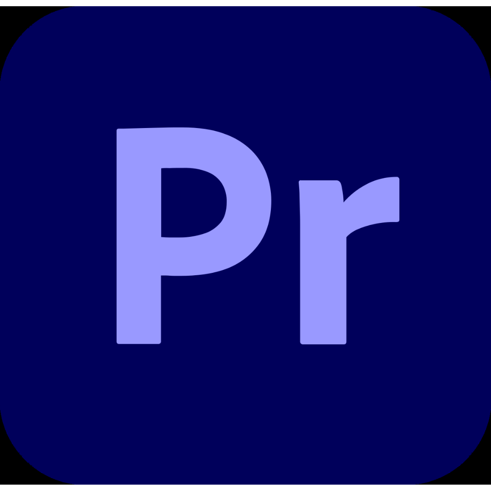
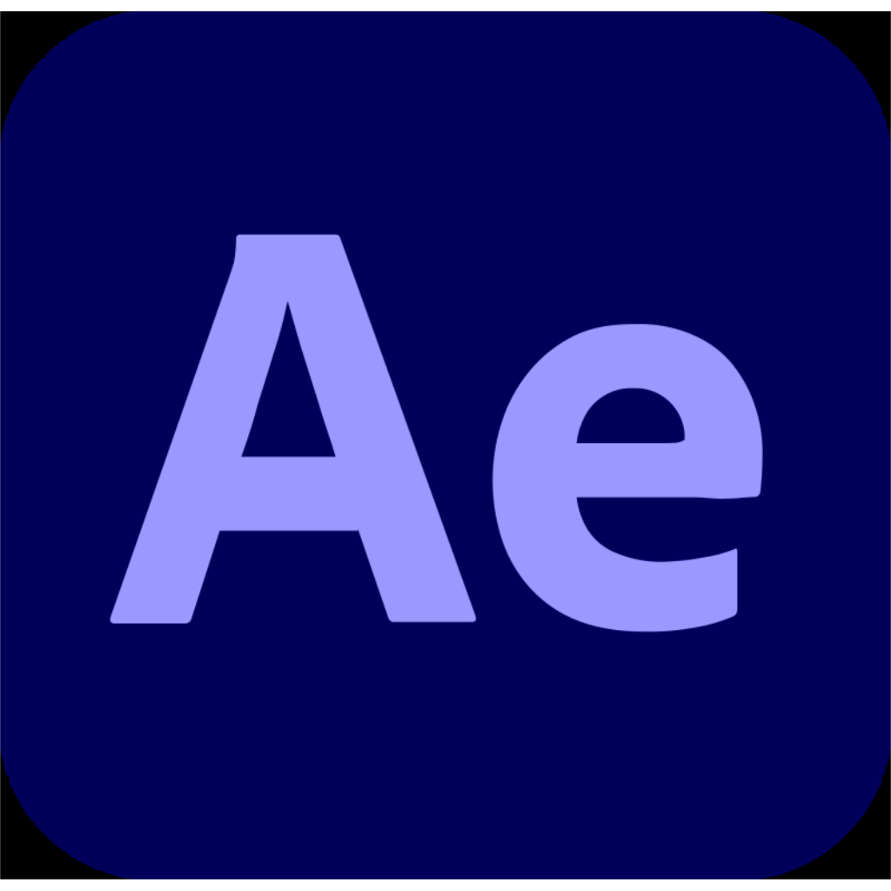
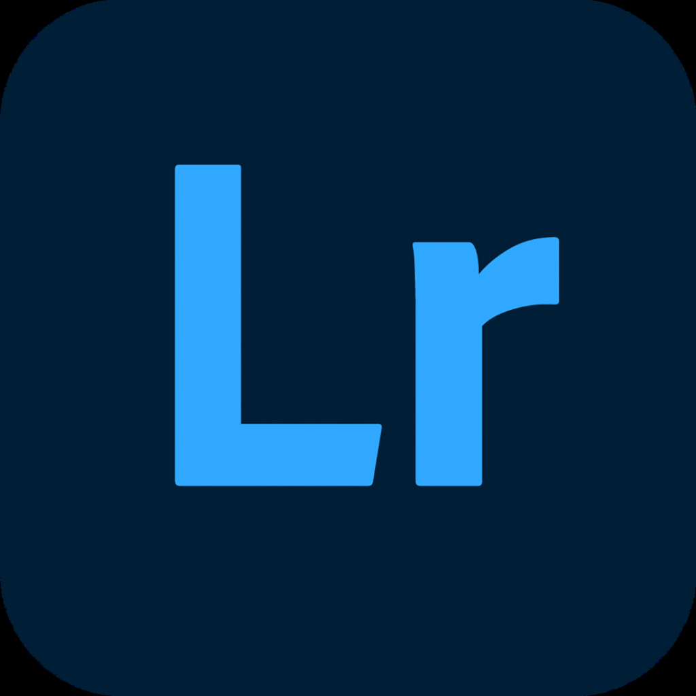
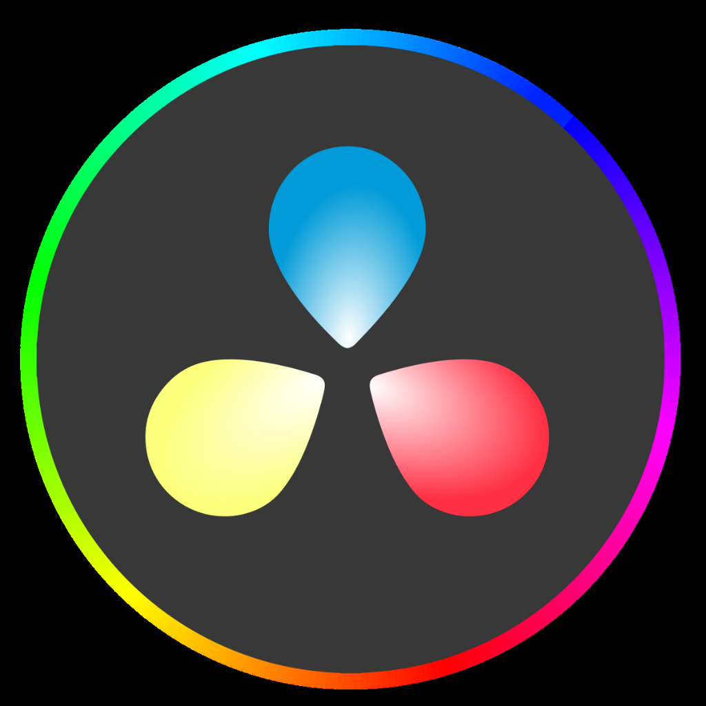
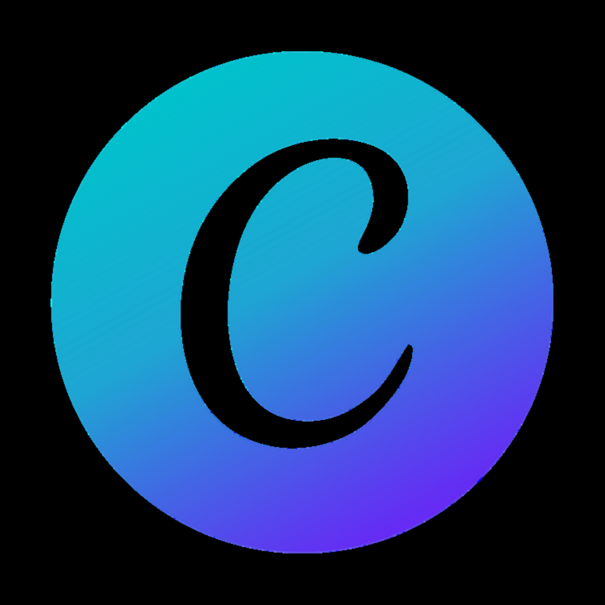

<h1 align="center">
  Hi, I'm Jhony Aguilar!
  
</h1>

  
  

  

---

- 💻 I’m a passionate developer  
- 🌐 Visit my [GitHub](https://github.com/Jhony410)  
- 🛠️ Languages: `.cpp`, `.html`, `.py`, `.c`
- 🧠 Learning: Docker, TypeScript  
- 🌟 Open to collaboration and learning  

---

### 📊 GitHub Stats

<table align="center">
  <tr>
    <td>
      
    </td>
    <td>
      
    </td>
  </tr>
</table>

<h2 align="center">Top Languages 👇</h4>

  

---

### 🤝 Connect with me

<h3 align="center">🤝🏻 Connect with me</h3>

  
  
  
  
  

<h3 align="center">🔥 Tech I Love</h3>

  <!-- JavaScript -->
  
  <!-- Python -->
  
  <!-- React -->
  
  <!-- GitHub -->
  
  <!-- VS Code -->
  
  <!-- MySQL -->
  
  <!-- Android Studio -->
  
  <!-- C++ -->
  
  <!-- PHP -->
  
  <!-- Kotlin -->
  
  <!-- Visual Studio -->
  
  <!-- PostgreSQL -->
  
  <!-- C (respaldo) -->
  
  <!-- GO (respaldo) -->
  
  <!-- Docker (respaldo) -->
  
  <!-- HTML -->
  
  <!-- CSS -->
  

---

<h3 align="center">🎨 Creative Tools</h3>

  <!-- Photoshop -->
  
  <!-- Illustrator -->
  
  <!-- Premiere Pro -->
  
  <!-- After Effects -->
  
  <!-- Lightroom -->
  
  <!-- CapCut -->
  
  <!-- DaVinci Resolve -->
  
  <!-- Camera RAW -->
  
  <!-- Canva -->
  

---

<h2 align="center">
   I ❤ Open Source.
</h2>
